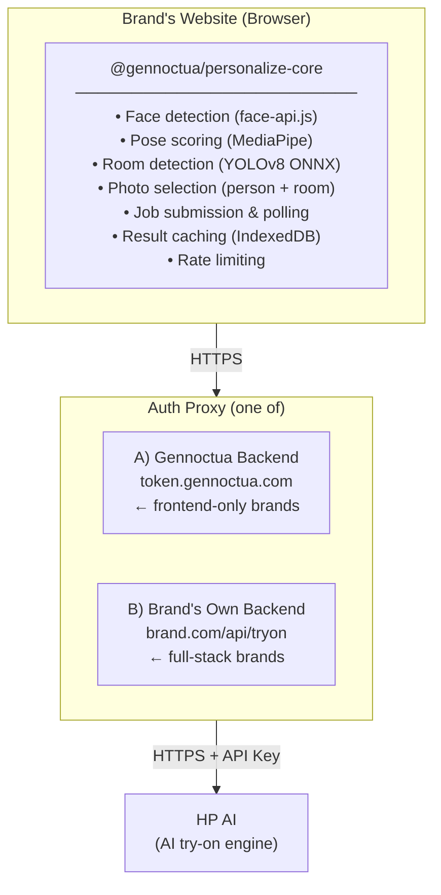
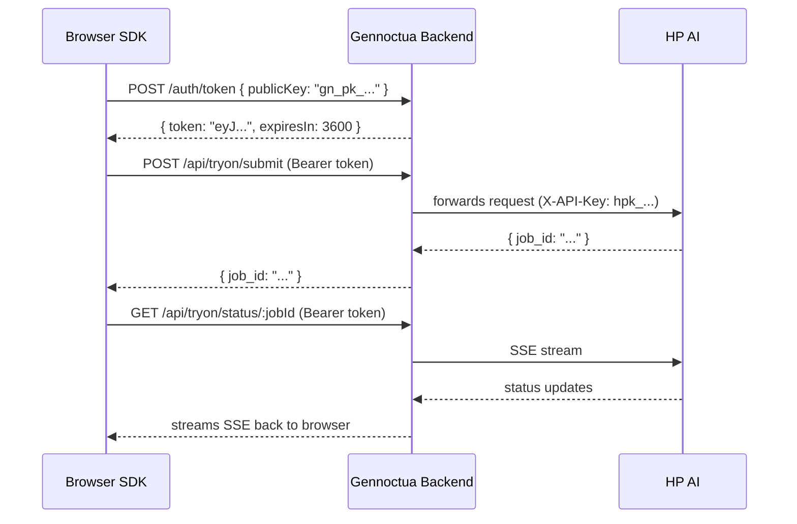
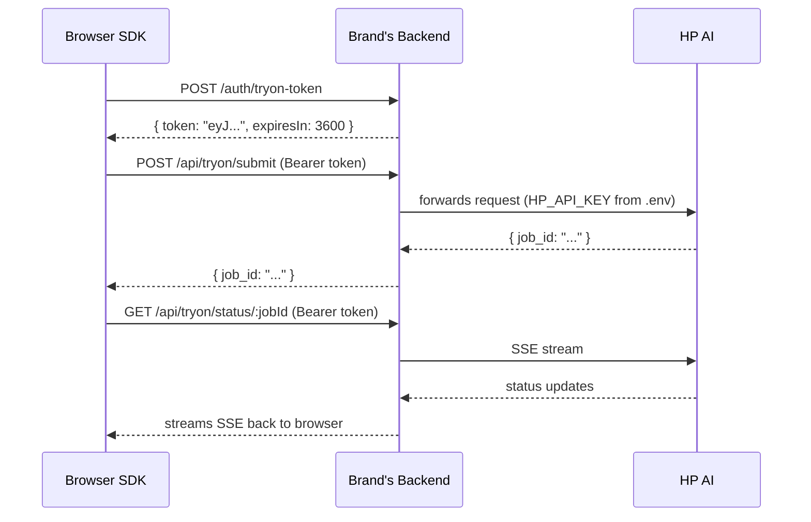
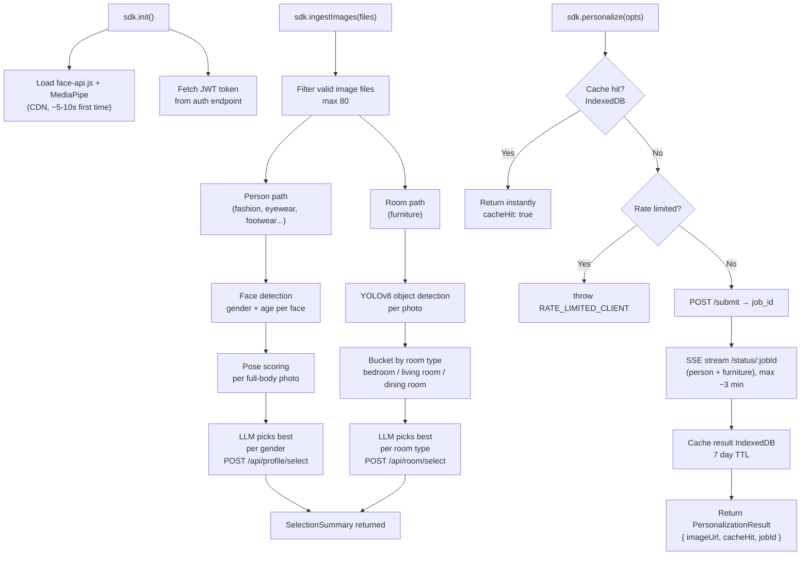

## System Overview

---

## Two Auth Paths

### Path A — Frontend-Only (via Gennoctua)

Used by brands with no backend (Shopify, Webflow, plain HTML).

### Path B — Full-Stack (brand's own backend)

Used by brands that have their own Node.js, Next.js, Express, etc. backend.

---

## What Runs Where

| Component | Where it runs | What it does |
|---|---|---|
| Face detection | **Browser** (WebAssembly) | Detects faces in uploaded photos |
| Pose scoring | **Browser** (WebAssembly) | Scores body poses for best photo selection |
| Room detection | **Browser** (ONNX / WebAssembly) | Detects furniture objects to classify room type |
| Photo selection | **Browser** + **proxy → Hyperpersona** (LLM) | Picks best person photo per gender, best room photo per room type |
| Token generation | **Backend** (Gennoctua or brand) | Issues short-lived JWTs |
| Job submission | **Backend** (proxy) | Forwards multipart form to HP |
| SSE streaming | **Backend** (proxy) | Streams job status back to browser |
| Result caching | **Browser** (IndexedDB) | Caches try-on results for 7 days |
| AI generation | **HP** | Generates the try-on image |

---

## Data Flow: Full Try-On Lifecycle

---

## HP API

HP is the AI backend that generates the try-on images. Gennoctua manages the relationship with HP — brands never interact with it directly.

| Endpoint | Method | Purpose |
|---|---|---|
| `/api/tryon/submit` | POST | Submit a try-on job |
| `/api/tryon/status/:jobId` | GET (SSE) | Stream job status |
| `/api/eyewear/submit` | POST | Eyewear category |
| `/api/eyewear/status/:jobId` | GET (SSE) | Eyewear status |
| `/api/footwear/submit` | POST | Footwear category |
| `/api/makeup/submit` | POST | Makeup category |
| `/api/accessories/submit` | POST | Accessories category |

The SDK automatically routes to the correct endpoint based on `productType`.

---

## Security Model

| Threat | Mitigation |
|---|---|
| HP API key exposed in browser | Key lives on backend only, never sent to browser |
| Stolen JWT used to make requests | JWTs expire in 1hr, rate limiting caps abuse |
| Brand key leaked | Only gets JWTs, cannot directly call HP |
| Excessive requests (abuse) | Client-side + server-side rate limiting |
| Expired token | SDK auto-refreshes in PublicKey mode, `getToken` called again in proxy mode |
